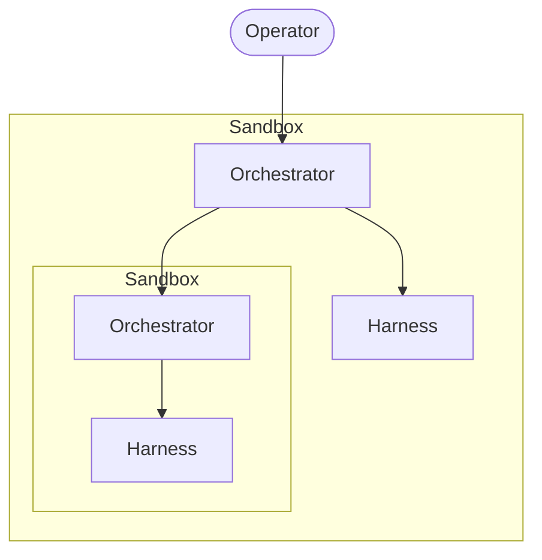

# Four words that made multi-agent click: Operator, Sandbox, Orchestrator, Harness.

For two years I called everything "an agent." The thing typing in my terminal — agent. The shell script that ran it — agent harness. The container it lived in — also "the agent." When I tried to describe my setup to someone else, the word stopped working halfway through the second sentence.

Then I drew it on a whiteboard. The boxes had different shapes. Four shapes, four jobs. And the reason my setup felt fragile — the reason I kept tripping over myself reasoning about it — was that I'd been collapsing four distinct things into one word.

Here are the four.

<!-- truncate -->

## Operator

The human. You. The one with the goal, the deadline, the taste.

The operator does not write code or run commands directly; the operator *directs* the layer below. The operator is the only layer with a will. Everything below is a means.

## Sandbox

A property, not a thing. The sandbox is the isolation boundary around an agent layer — a container, a worktree, a VM, a separate machine. Its job is exactly one: **changes inside cannot affect anything outside unless explicitly promoted.**

Sandboxes are orthogonal to the rest of the stack. They wrap. Any layer can have one. Different layers can have different ones. A sandbox doesn't *do* anything — it constrains what the layer it wraps is allowed to break.

## Orchestrator

The conductor. Operates on behalf of the operator. Reads the goal, decomposes it, delegates to one or more harnesses — or to sub-orchestrators — and aggregates the results.

The orchestrator's defining property: **it does not do the work itself.** It coordinates. The moment you find your orchestrator writing application code, you've collapsed a layer; the cost shows up later as fragility no one can explain.

## Harness

The leaf. The combination of an *agent* — the LLM doing the thinking — plus the *environment engineering* around it: prompts, tools, context, memory, filesystem, network access. A harness is what actually touches reality.

A harness has no children. If you find yourself wanting to give a harness sub-agents, you've discovered it should have been an orchestrator.

## The unlock: orchestrator and harness are the same shape

Once I named these, the recursion fell out for free.

An orchestrator delegates to harnesses. Or it delegates to other orchestrators, which delegate to *their* harnesses. The recursion bottoms out at the harness — the leaf that does real work.

Sandboxes wrap each level independently. The main orchestrator runs in one sandbox; a sub-orchestrator can run in its own. A harness can share its orchestrator's sandbox, or get its own when a sub-task needs full isolation.

That's the whole model. Four roles. Two of them — orchestrator and harness — are the same recursive shape at different depths. One — sandbox — is an isolation property that wraps anything. One — operator — is you.

## How this lives in Open Harness

The clearest worked example I can point at:

- **Operator** — me at the keyboard, holding the goal.
- **Sandbox** — the Docker container the orchestrator runs in. A worktree with its own `.devcontainer` becomes a sandbox-within-a-sandbox when a sub-task needs full isolation.
- **Orchestrator** — `claude` at the repo root, with a `CLAUDE.md` that enforces *"do not write application code."* Its job is to spawn harnesses, run skills, manage git, ship PRs.
- **Harness** — a sub-agent the orchestrator delegates to via the `Agent` tool: `implementer`, `critic`, `pm`, `general-purpose`. Each is an LLM + a constrained tool list + a focused prompt. Each touches code.

The orchestrator is itself a harness for *me*. The implementer is a harness for the orchestrator. Same shape, different depth, sandboxes wrapping each layer.

Naming was the unlock. Once I had the words, I stopped writing setups that felt mysterious to debug — because I could now point at which layer the bug lived in.

If you've been calling everything "an agent," try the four for a week. The setups you build after will be easier to draw — and the ones you've already built will be easier to fix.
