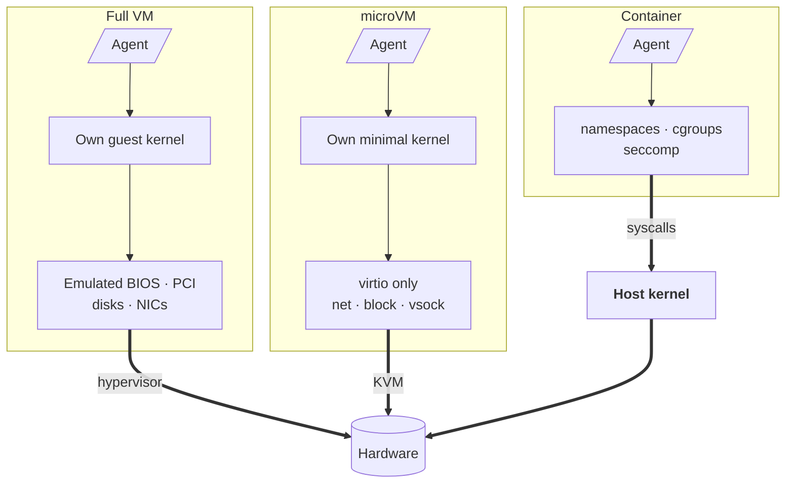
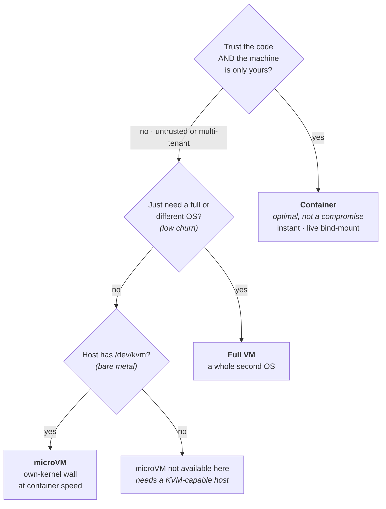

Open Harness runs every coding agent inside a Docker container — one sandbox per repo, your workspace bind-mounted in, the agent free to thrash around without ever touching your laptop. That a container beats a full VM for this was already settled. What I spent last week researching was the next contender: whether a Firecracker **microVM** should *replace* the container underneath it.

The honest answer was no — not because the microVM is weak, but because it's built for a job Open Harness doesn't do yet (running untrusted agents for many tenants on shared hardware) and is a worse fit for the one it does. Chasing that down only reinforced the container as the right default: the instant, live-editable sandbox you get the moment you point the harness at a repo is exactly what a microVM would take away. Getting there forced me to lay out the three ways you can put a box around an AI agent — a full VM, a container, and the microVM in between — so here's the whole mental model.

<!-- truncate -->

## Two axes, three boxes

Every isolation technology is a trade between two things: **how strong the wall is** between the workload and everything else, and **how cheap it is** to stand that wall up — boot time, memory, density, and the developer experience of living inside it.

Containers max out the second axis. Full VMs max out the first. The microVM is the interesting one because it refuses to fully concede either. What actually moves along that first axis is one thing: the **kernel boundary** — does the workload get its own kernel, or does it share the host's?

*One difference drives the rest: the container (what Open Harness runs today) shares the **host kernel**, while the full VM and the Firecracker microVM each get their own. The microVM keeps a kernel but sheds the heavy device model — and, as the price, trades the live bind-mount for a virtio-fs/vsock sync.*

## The full VM: the wall that costs the most

A virtual machine asks the hardware to pretend to be a whole second computer. A hypervisor (KVM, VMware, Hyper-V) gives each guest its own kernel, its own emulated BIOS, a virtual PCI bus, virtual disks and NICs — the full pantomime of physical hardware. Nothing the guest does reaches the host kernel, because the guest *has its own kernel*. That's the strongest isolation in common use.

You pay for it. A full guest boots a full operating system — seconds, sometimes minutes. It carries hundreds of megabytes to gigabytes of memory overhead before your workload does anything. You fit tens of them on a host, not thousands. And the sprawling device emulation that makes the boundary real is itself a large, decades-old attack surface.

For an AI agent you spin up and tear down constantly — or one you want to launch on demand, per request, by the thousand — that cost is disqualifying. Which is exactly the problem AWS had with Lambda.

## The container: what Open Harness runs today

A container is the opposite bet. No second kernel, no emulated hardware. Your agent is just a process on the host, fenced off with three Linux primitives: **namespaces** (it sees its own PIDs, network, filesystem), **cgroups** (it gets bounded CPU and memory), and **seccomp/AppArmor** (dangerous syscalls are denied).

Because there's no hardware to emulate and no OS to boot, a container starts in milliseconds and adds almost no memory overhead. You pack hundreds on a host. And — the part that matters most for a coding agent — you can **bind-mount your actual working directory straight in.** The agent edits files; you see the edits instantly in your editor, with no sync layer between. Open Harness leans on this hard: one Docker Compose sandbox per branch, your repo mounted live, even the Docker socket passed through so the agent can run its own containers ([`.devcontainer/docker-compose.yml`](https://github.com/mifunedev/openharness/blob/main/.devcontainer/docker-compose.yml)).

The catch is the shared kernel. A container is a fence, not a wall, and two specific cracks matter:

- **The socket is root.** Open Harness bind-mounts `/var/run/docker.sock` so the agent can build and run containers. Anything holding that socket can `docker run` a privileged container that mounts the host's `/` — a one-line escape to root on your machine.
- **A kernel bug is a host bug.** Every container shares the host kernel, so a single kernel CVE or seccomp bypass is a direct hit. There's no second boundary behind the first.

Here's what people miss when they recoil at that: **for Open Harness's actual job, none of it is a problem.** You're running *your own* agent, on *your own* machine, against *your own* code. The threat isn't a malicious attacker — it's a confused agent `rm`-ing the wrong directory, and the container contains that perfectly. Paying for kernel-grade isolation here buys nothing and costs you the live bind-mount, the instant boot, and the Docker passthrough that make the thing pleasant to use. The container isn't a compromise for this use case. It's the right answer.

The trust assumptions only break when one of them flips: the code isn't yours, or the machine isn't only yours.

## The microVM: a real kernel boundary at container speed

That flip is what [Firecracker](https://firecracker-microvm.github.io/) was built for. It's the VMM behind AWS Lambda and Fargate, where Amazon runs millions of strangers' functions on shared hardware and absolutely cannot let one reach another.

A Firecracker **microVM** is a real virtual machine — own kernel, KVM-enforced hardware boundary, the strong wall from the VM section. But it throws away everything that made the VM slow. No BIOS, no PCI, no legacy device emulation. The guest gets a minimal set of `virtio` devices (a network interface, a block device, a vsock pipe) and little else. The result is a VM that **boots in about 125 milliseconds and adds under 5 MB of memory overhead** — container-class numbers behind a VM-class boundary. The host-facing VMM process is itself wrapped by a `jailer` that drops it into its own cgroups, namespaces, chroot, and seccomp filter, so even a compromised hypervisor has another fence around it.

That boundary closes exactly the cracks the container left open. A separate kernel means a guest kernel exploit stops at the KVM wall instead of reaching the host. Dropping the Docker socket — the microVM tier wouldn't mount it — removes the root-escape entirely. And one VM per tenant means one tenant's runaway agent can't read another's memory or files.

It is not free, and the research was mostly about cataloguing the bill:

- **Live editing gets harder.** A microVM can't bind-mount your host directory the way a container does. You expose the workspace through `virtio-fs` or a `vsock` file-sync instead — a layer between the agent and your files that doesn't exist today. This is the single biggest hit to the developer experience.
- **You need bare metal.** Firecracker requires `/dev/kvm`. Most standard cloud VMs don't expose nested virtualization, so the microVM tier wants a bare-metal host (Equinix, Hetzner dedicated, an AWS `*.metal` box) — not the cheap VPS a hobbyist already has.
- **It doesn't fix everything.** A microVM walls off the kernel; it does nothing about a poisoned base image. Supply-chain trust is a separate problem on every row of the table below.

## So which box?

| | Full VM | Container | microVM |
|---|---|---|---|
| Isolation wall | Hardware (own kernel) | Shared kernel + namespaces | Hardware (own minimal kernel) |
| Boot | Seconds–minutes | Milliseconds | ~125 ms |
| Memory overhead | Hundreds of MB–GB | ~Zero | < 5 MB |
| Density per host | Tens | Hundreds–thousands | Thousands |
| Live file editing | Shared-folder, clunky | Native bind-mount | virtio-fs / vsock sync |
| Host requirement | A hypervisor | Just a kernel | `/dev/kvm` (bare metal) |
| Right when… | You need a full second OS | You trust the code, want speed | You're running code you don't trust |

The decision collapses to one question: **do you trust the code, and is the machine only yours?**

*Supply-chain trust of the base image is a separate problem on every path.*

- **Yes to both** — a developer running their own agent on their own box. Container, every time. The microVM's wall guards against a threat that isn't present; the VM's cost buys nothing. This is most agent work happening today, and the container isn't the budget option for it — it's optimal.
- **No** — untrusted, model-generated, or third-party agents, especially many tenants on shared hardware. That's the microVM's entire reason to exist: VM-grade isolation cheap enough to run per-request at fleet scale.
- **Full VM** stays the answer only when you genuinely need a whole second operating system (a different OS, a full device stack) and churn is low. For on-demand agents it's the wrong shape — the gap Firecracker was invented to fill.

## Where this leaves Open Harness

Open Harness stays a container, and that's a deliberate call, not a default I never questioned. Its center of gravity is one developer, in a terminal, running an agent they trust against code they own. For that — most cases — the container is the best box on the board: instant, live-editable, full-powered, and contained against the only failure mode that actually shows up.

The microVM doesn't replace that; it's an **added isolation tier** for when the trust assumption flips — running untrusted agents, or eventually a multi-tenant hosted sandbox on mifune.dev. The shape is a config switch, `isolation: docker` (default) or `microvm`, reusing the same image pipeline, with the Docker socket dropped on the harder tier. It's still desk research — a go/no-go, not shipped code — and a microVM that breaks live editing has to earn its place against everything the container already does for free. But the principle is clear: pick the box that matches the threat, and for the threat most people actually have, the container wins.

## Where to run it

There's a second axis this piece sets aside on purpose: *where the container runs*. Isolation is the box around the agent; the host is the machine that box sits on — independent choices. Your laptop is the fastest way to start, and the best first move: clone, `make sandbox`, and an agent is working in seconds. But the better long-term home is a small always-on VM with Docker as its only dependency. Move the same container there and the agent keeps grinding through a long task with your laptop lid shut, survives a reboot, and is reachable from wherever you SSH in. Notice the role the VM plays here — it's the *host running Docker*, not a per-agent isolation wall. Same word as the heavyweight box up top, opposite job: the container is still the box; the VM is just what keeps it powered on.

## Try it

The container harness is open today. Start at the [installation guide](/docs/installation) or the [quickstart](/docs/quickstart) — clone it, point it at a repo, and watch an agent work in a box that boots before you've let go of the Enter key. The microVM tier is being researched in the open; the trade-offs above are the whole reason it's a tier and not a replacement.
