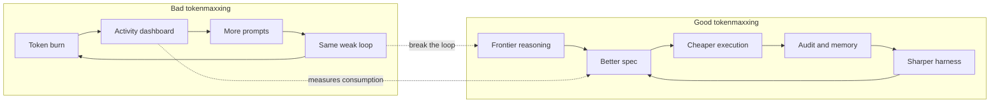
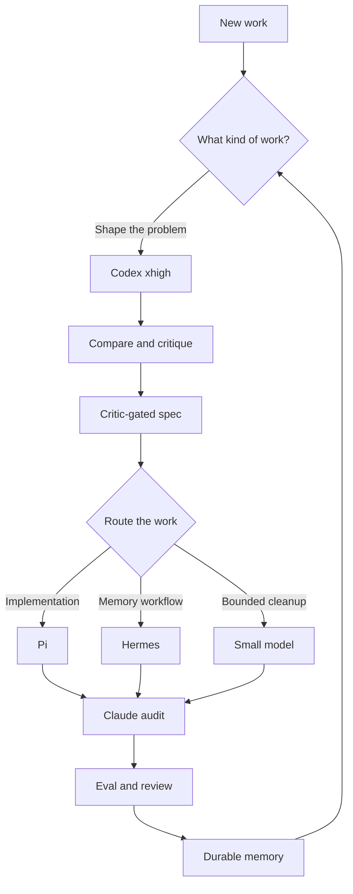

Tokenmaxxing is getting the hangover treatment. The same behavior that looked like aggressive AI adoption a few months ago is now being written up as runaway cost: [Pylon's bill jumping into enterprise pricing](https://www.businessinsider.com/pylon-ceo-tokenmaxxing-era-coming-to-end-ai-spend-limits-2026-6), [Fortune calling tokenmaxxing a bad ROI metric](https://fortune.com/2026/05/28/tokenmaxxing-is-dead-companies-didnt-get-the-roi-from-ai-they-wanted-to-see/), [WSJ covering the companies that treated it as survival](https://www.wsj.com/cio-journal/why-some-companies-say-ai-tokenmaxxing-is-key-to-survival-e699a128), and [Satya Nadella admitting the habit is addictive](https://www.windowscentral.com/artificial-intelligence/microsoft-ceo-satya-nadella-says-ai-tokenmaxxing-is-costly-im-a-tokenmaxxer-too-its-addictive).

The obvious lesson is that tokens are not output. A leaderboard that rewards the person who burned the most model context is just a speedometer bolted to the wrong machine. It tells you activity happened. It does not tell you whether the spec improved, whether the code survived review, or whether the next run got easier.

But the opposite lesson is wrong too. "Tokenmaxxing is dead" turns into nonsense if it means "stop spending frontier tokens." The useful version is narrower: spend the expensive tokens where they improve the harness, not where they become the scoreboard.

<!-- truncate -->

## Bad tokenmaxxing

Bad tokenmaxxing is easy to recognize because the unit of celebration is consumption.

How many tokens did the team burn? How many prompts did each engineer send? How many seats are active? How many generated lines landed? Those are not useless operational counters, but they are terrible success metrics. They invite the same mistake as measuring a build system by CPU minutes instead of shipped, tested behavior.

For agentic engineering, raw token burn is especially misleading. A bad agent can spend a fortune wandering through the repo, rewriting the same file, and asking a bigger model to summarize its own confusion. A good harness can spend a small amount of frontier context to reject a weak plan before any code exists, then let a cheaper or more project-specific executor do the repetitive work.

The difference is not thrift. The difference is where the intelligence compounds.

## Good tokenmaxxing

Good tokenmaxxing is frontier comparison that improves a custom harness.

That means using the strongest model for the moments where the shape of the work is still plastic: naming the problem, comparing plans, finding hidden assumptions, writing the acceptance criteria, and letting adversarial critics attack the spec before the repo has to carry it. Those tokens are not buying output volume. They are buying fewer bad branches.

This is how Open Harness treats Codex `xhigh`. I want it in the comparison path: ideation, brainstorming, plan comparison, `/ship-spec` shaping, and spec critique. It is good at holding multiple possible plans in tension and saying which one is actually simpler. That is the expensive part I want upstream of the work.

After that, implementation should increasingly flow through the harness I am building, not through an endless manual conversation with the frontier model.

## The Open Harness split

Open Harness is not an enterprise token-governance product, and this is not a vendor ranking. It is a single-developer harness for one project at a time. The useful question is not "which model wins?" It is "which part of the workflow should carry the most expensive reasoning?"

For this repo, the split looks like this:

**Codex `xhigh` is for comparison.** It belongs before commitment, where the cost of changing your mind is still low. Use it to generate alternative plans, critique the plan you like, tighten `/ship-spec`, and decide whether the task belongs in the harness at all.

**Pi is the main coding harness when implementation behavior matters.** Pi is where the project-specific loop can live: planning mode, task tracking, background monitors, statusline context, Codex usage visibility, and fallback model paths. If the goal is to teach the project how it likes work done, Pi is the place to accumulate that behavior.

**Hermes is optional, but it is the right primary harness for memory-heavy operator workflows.** Open Harness does not ship Hermes as the default image path; it is enabled explicitly. When the workflow wants persistent memory, self-improving skills, scheduled automation, or Slack/chat operator surfaces, Hermes has a native shape for that. It is not "better than Pi." It is a different center of gravity.

**Claude is for audit, compound, compress, eval, and high-confidence review loops.** In this harness, Claude is still the place I trust for certain review and synthesis passes: turning session evidence into durable memory, checking whether a change really made the system better, compressing context without losing the load-bearing parts, and running the high-confidence audit loop before a PR leaves draft.

**Haiku-class models are for cleanup.** Summaries, formatting, low-risk polish, changelog drafts, small transformations, mechanical copy passes. If a task has a narrow input, a narrow output, and a cheap way to verify it, it should not be renting the biggest brain in the building.

That split can change. It should change. A harness that cannot route work differently as the tools improve is not a harness; it is just a habit.

## Where the tokens should go

The expensive model should make the next cheaper run better.

That is the rule I care about. Spend frontier tokens on the spec, the critique, the comparison, and the harness behavior that survives the session. Do not spend them to inflate a dashboard. Do not spend them to make a leaderboard feel alive. Do not spend them because an internal graph rewards "AI usage" without proving that the resulting work got safer, clearer, or easier to repeat.

The practical loop is:

1. Use frontier context to compare approaches.
2. Turn the selected approach into a critic-gated spec.
3. Route implementation through the project harness.
4. Audit the result with a fresh context.
5. Promote the durable lesson back into the harness.

That is tokenmaxxing worth keeping. The tokens disappear, but the harness remains sharper than it was before.

## Where this leaves Open Harness

The right endpoint is not a team that burns more tokens every week. The right endpoint is a harness that needs fewer heroic frontier sessions because it has absorbed the last ones.

Codex `xhigh` should raise the quality of the comparison and the spec. Pi or Hermes should absorb the project-specific implementation loop. Claude should keep the audit and memory system honest. Smaller models should take the cheap, bounded work.

That is the version of tokenmaxxing I want: not maximizing token burn as a metric, but spending the best tokens where they make the system better at spending the next ones.
