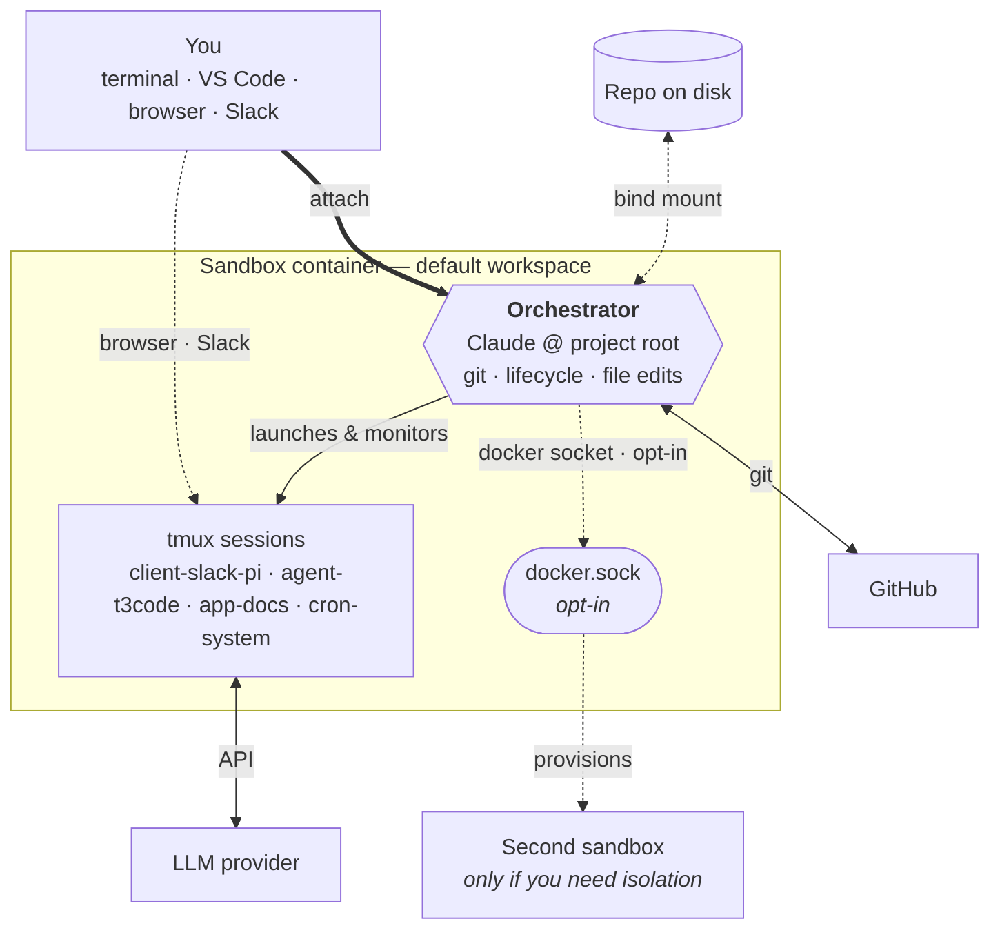

# Open Harness

Open Harness is your **portable harness** — one repo per sandbox — that wraps your project in an isolated Docker container and versions its state. The repo tracks the agent's identity, skills, crons, and memory in git; the sandbox keeps the agent (Claude Code, Codex, Pi, or another of your choice) off your host machine. The agent owns its workspace, runs against your code, and wakes itself on a schedule via a tiny croner runtime.

## Start Here

Open Harness provides the sandbox; you choose the harness — a Docker workspace you
clone-and-own, where `make sandbox` boots one long-lived container and the coding agent
of your choice (Claude Code, Codex, Pi, Hermes, and more) works on its own branch and
identity, running identically on your laptop or an unattended, lights-out remote VM.

### Attach in 3 lines (VS Code)

1. `make sandbox` — build the image and boot the container.
2. VS Code → Command Palette (Ctrl/Cmd+Shift+P) → "Dev Containers: Attach to Running
   Container" → select `openharness`. Ports auto-forward while attached.
3. Open a terminal inside the container and run `claude` (or `codex` · `pi` · `hermes`).

Full terminal / Remote-SSH options: see [Connecting → Option B](/docs/connecting#option-b--vscode-attach-to-running-container-local-host).

### Prefer Hermes?

[Hermes](/docs/harnesses/hermes) — Nous Research's self-improving agent CLI — is an opt-in harness: set
`install.hermes: true` in harness.yaml, rebuild, then run `hermes setup`.

:::tip You're reading it
This IS the rendered docs site (oh.mifune.dev) — use the search bar (top-right) to jump anywhere.
:::

## What is Open Harness?

Open Harness is a single repo that *is* your harness: it boots one Docker container — the sandbox — and wraps your project inside it. You bring the sandbox up with `docker compose`, attach to it from your terminal or VS Code, and let your chosen agent work the project over time. Because the harness is a git repo, its whole setup is tracked and versioned — reproducible and portable. There is no per-agent fan-out and no host CLI; everything happens through standard `docker compose` commands and the croner runtime that ships in the image.

Key capabilities:

- **One repo, one sandbox.** Your portable harness is one repo; it boots one container. The agent owns its workspace; your machine stays clean — you're not running agents straight on your host.
- **Markdown-defined crons.** `crons/*.md` files declare schedules; an in-container croner runtime fires the bodies as agent prompts so the agent can work autonomously while you focus on other things.
- **Host dependencies: Docker, Git, and make.** No Node, no Python, and no toolchain maintenance required on your laptop. (`make` drives the `make sandbox` / `make shell` wrappers — see [Prerequisites](/docs/installation#prerequisites).)
- **Cloudflared previews.** Share sandbox app ports through Cloudflared tunnels; SSH and pack-supplied services remain opt-in Docker Compose overlays.
- **Multi-agent messaging.** Bridge Slack (and other messengers) to a Pi agent with the [`pi-messenger-bridge`](/docs/integrations/slack) npm package; SSH and pack-supplied services remain opt-in Docker Compose overlays.

## How it works

The harness uses Docker Compose to build a sandbox image from `.devcontainer/`. You bring the sandbox up with `docker compose -f .devcontainer/docker-compose.yml up -d --build`, attach with `docker exec -it -u sandbox openharness zsh` (or VS Code), authenticate GitHub and your chosen LLM provider once, then launch the agent with `claude` inside the sandbox. When you're done, `docker compose -f .devcontainer/docker-compose.yml down -v` tears everything down.

The agent session you attach to at the project root is your **orchestrator** — git, sandbox lifecycle, and most file edits all flow through a single attach. When the optional Docker socket is enabled (off by default), the orchestrator can also drive other containers and edit files inside them over that socket, so day-to-day work rarely needs anything else. Drop back to the host shell only when something can't be done from inside the container — typically adding a new bind-mounted volume, which requires a `.devcontainer/docker-compose.yml` change and restart.

Stand up a **second sandbox** only when you want isolation — an independent identity, branch, or provider key running on its own. Most users won't need this.

Inside the sandbox, a `cron-system` tmux session runs `scripts/cron-runtime.ts`, which reads `crons/*.md` and fires each body as a prompt to the configured agent on its declared schedule.

## How to read these docs

If you are new, follow this order:

1. [Installation](/docs/installation) — install Docker.
2. [Quickstart](/docs/quickstart) — go from zero to a running sandbox in under five minutes.

If you already have a sandbox running, jump directly to the page you need.

## Where to get help

- Source code and issues: [github.com/mifunedev/openharness](https://github.com/mifunedev/openharness)
- Learning material: [Resources](/docs/resources)
- Philosophy: [How Open Harness embodies compound engineering](/blog/compound-engineering) — why each unit of work here should make the next one easier.

[Connecting to the Sandbox](/docs/connecting)
