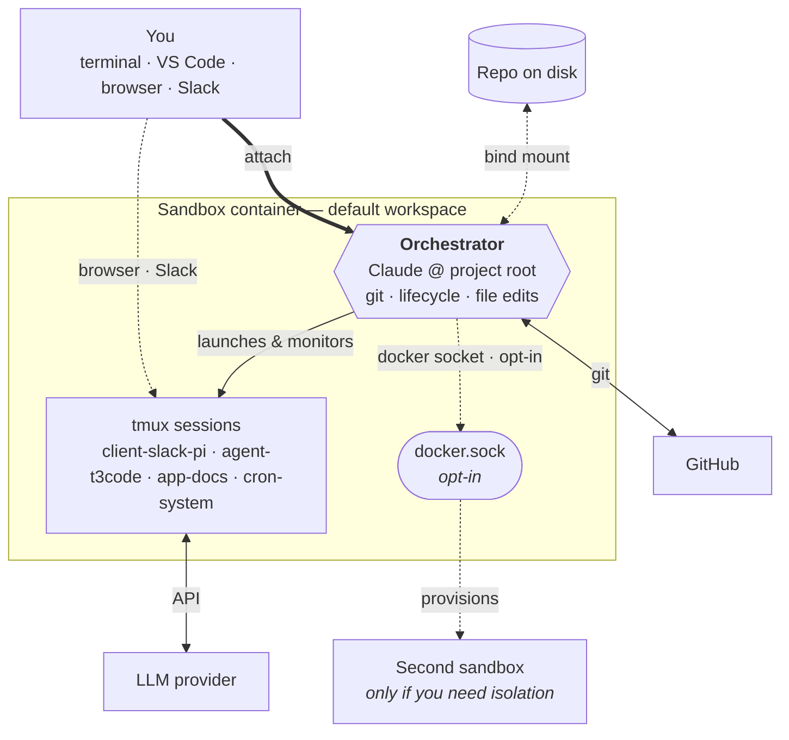

# Open Harness

Open Harness is a durable home for autonomous coding agents. It keeps an agent's tools, identity, schedules, branches, and communication channels with the project instead of scattering them across a laptop. Docker provides the isolated runtime. The portable control plane under `.oh/` keeps the agent environment reproducible in git.

## Start Here

Open Harness provides the workspace; you choose the coding harness. Claude Code,
Codex, Pi, Hermes, and other harnesses share the same project state and portable
control plane. Run the workspace on a laptop or leave it on a remote VM where agent
sessions continue after you disconnect.

### Attach in 3 steps (VS Code)

1. `make sandbox` — build the image and boot the container.
2. VS Code → Command Palette (Ctrl/Cmd+Shift+P) → "Dev Containers: Attach to Running
   Container" → select `openharness`. Ports auto-forward while attached.
3. Open a terminal inside the container and run `claude` (or `codex` · `pi` · `hermes`).

Full terminal / Remote-SSH options: see [Connecting → Option B](/docs/connecting#option-b--vscode-attach-to-running-container-local-host).

### Prefer Hermes?

[Hermes](/docs/harnesses/hermes) — Nous Research's self-improving agent CLI — is an opt-in harness.
Run `oh harness install hermes` inside the sandbox to add it without a rebuild, then run
`hermes setup`.

:::tip You're reading it
This IS the rendered docs site (oh.mifune.dev) — use the search bar (top-right) to jump anywhere.
:::

## What is Open Harness?

Open Harness surrounds your chosen coding harness with two layers. `.devcontainer/` defines the isolated Docker runtime. `.oh/` provides the portable control plane for agent identity, schedules, task procedures, and checks. Bring the sandbox up with Docker Compose, attach from a terminal or VS Code, and let agent sessions work over time. Herdr preserves interactive terminals, named tmux sessions hold unattended services, and git worktrees isolate parallel branches. No host CLI is required: standard Docker Compose commands and their `make` wrappers remain available. The standalone `oh` CLI is also baked into the sandbox image and can equip another repository. See [Lifecycle commands](/docs/lifecycle-commands) for each entry point.

Key capabilities:

- **A stable agent environment.** The portable control plane stays with the project while Docker isolates execution from the host. Agent sessions own their workspaces; your machine stays clean.
- **Markdown-defined crons.** `crons/*.md` files declare schedules; an in-container croner runtime fires the bodies as agent prompts so the agent can work autonomously while you focus on other things.
- **Host dependencies: Docker, Git, and make.** No Node, no Python, and no toolchain maintenance required on your laptop. (`make` drives the `make sandbox` / `make shell` wrappers — see [Prerequisites](/docs/installation#prerequisites).)
- **Cloudflared previews.** Share sandbox app ports through Cloudflared tunnels; SSH and pack-supplied services remain opt-in Docker Compose overlays.
- **Multi-agent messaging.** Bridge Slack (and other messengers) to a Pi agent with the [`pi-messenger-bridge`](/docs/integrations/slack) npm package; SSH and pack-supplied services remain opt-in Docker Compose overlays.

## How it works

The harness uses Docker Compose to build a sandbox image from `.devcontainer/`. You bring the sandbox up with `docker compose -f .devcontainer/docker-compose.yml up -d --build`, attach with `docker exec -it -u sandbox openharness zsh` (or VS Code), authenticate GitHub and your chosen LLM provider once, then launch the agent with `claude` inside the sandbox. When you're done, `docker compose -f .devcontainer/docker-compose.yml down -v` tears everything down.

The agent session you attach to at the project root is your **orchestrator** — git, sandbox lifecycle, and most file edits all flow through a single attach. When the optional Docker socket is enabled (off by default), the orchestrator can also drive other containers and edit files inside them over that socket, so day-to-day work rarely needs anything else. Drop back to the host shell only when something can't be done from inside the container — typically adding a new bind-mounted volume, which requires a `.devcontainer/docker-compose.yml` change and restart.

Stand up a **second sandbox** only when you want isolation — an independent identity, branch, or provider key running on its own. Most users won't need this.

Inside the sandbox, a `cron-system` tmux session runs `scripts/cron-runtime.ts`, which reads `crons/*.md` and fires each body as a prompt to the configured agent on its declared schedule.

```mermaid
flowchart TB
    You["You<br/>terminal · VS Code · browser · Slack"]
    Repo[("Repo on disk")]
    GH["GitHub"]
    LLM["LLM provider"]

    subgraph sandbox["Sandbox container — default workspace"]
        Orch{{"<b>Orchestrator</b><br/>Claude @ project root<br/>git · lifecycle · file edits"}}
        Tmux["tmux sessions<br/>client-slack-pi · agent-t3code · app-docs · cron-system"]
        Sock(["docker.sock<br/><i>opt-in</i>"])
    end

    Sb2["Second sandbox<br/><i>only if you need isolation</i>"]

    You ==>|attach| Orch
    You -.->|browser · Slack| Tmux
    Repo <-.->|bind mount| Orch
    Orch -->|launches & monitors| Tmux
    Orch <-->|git| GH
    Tmux <-->|API| LLM
    Orch -.->|docker socket · opt-in| Sock
    Sock -.->|provisions| Sb2
```

## How to read these docs

If you are new, follow this order:

1. [Installation](/docs/installation) — install Docker.
2. [Quickstart](/docs/quickstart) — go from zero to a running sandbox in under five minutes.
3. [Docker deployment](/docs/docker-deployment) — run the public image with no checkout or build.

If you already have a sandbox running, jump directly to the page you need.

## Where to get help

- Source code and issues: [github.com/mifunedev/openharness](https://github.com/mifunedev/openharness)
- Learning material: [Resources](/docs/resources)
- Philosophy: [How Open Harness embodies compound engineering](/blog/compound-engineering) — why each unit of work here should make the next one easier.

[Connecting to the Sandbox](/docs/connecting)
